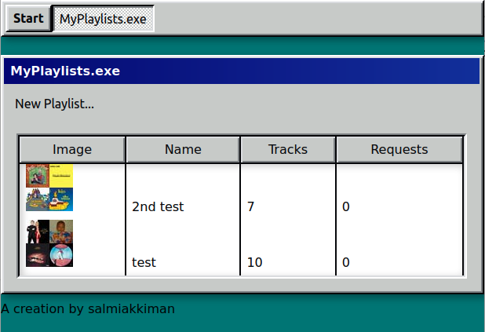

# Playlist Creator

<ol>
    <li>clone repository `git clone https://github.com/salmiakkiman/playlist-creator-full-stack`</li>
    <li>run the project `sudo docker-compose up -d` or `sudo docker-compose up --build`</li>
    <li>go to http://localhost:3000</li>
</ol>

## Basic functionality

<ol>
    <li>Login with Spotify account</li>
    <li>Create public Spotify playlists</li>
    <li>Share url of the playlist to others</li>
    <li>Search songs for requests</li>
    <li>Request songs for playlist</li>
</ol>

Front is build with Meteor & React.
Back is build with Python Flask.

Purpose was to create a retro looking website for bars, so their bartenderds can take song requests from clients.

This project was originally finished in 2020 summer.
